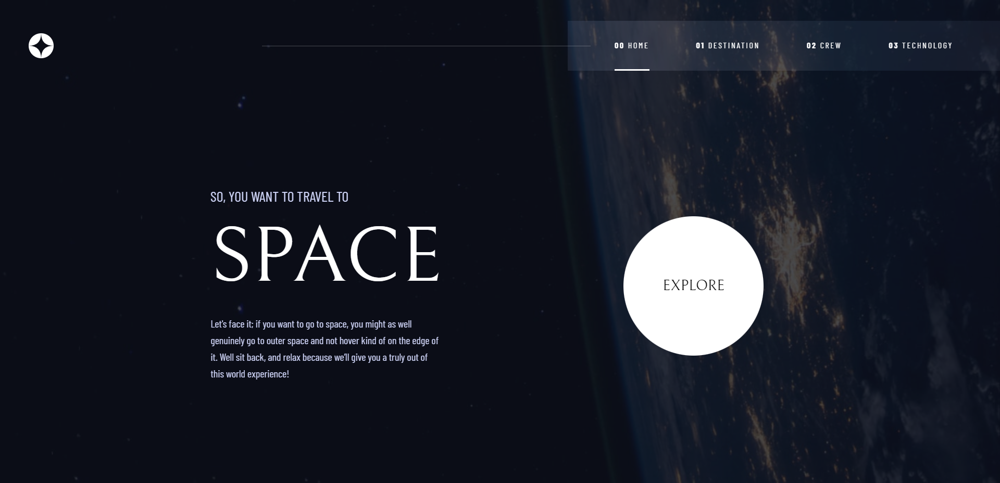

# Frontend Mentor - Space tourism website solution

This is a solution to the [Space tourism website challenge on Frontend Mentor](https://www.frontendmentor.io/challenges/space-tourism-multipage-website-gRWj1URZ3). 

## Table of contents

- [Overview](#overview)
  - [The challenge](#the-challenge)
  - [Screenshot](#screenshot)
  - [Links](#links)
- [My process](#my-process)
  - [Built with](#built-with)
  - [What I learned](#what-i-learned)
  - [Useful resources](#useful-resources)
- [Author](#author)

## Overview

### The challenge

Users should be able to:

- View the optimal layout for each of the website's pages depending on their device's screen size
- See hover states for all interactive elements on the page
- View each page and be able to toggle between the tabs to see new information

### Screenshot



## My process

### Built with

- CSS custom properties
- Flexbox
- Mobile-first workflow

### What I learned

I choose this project in order to learn more about how JSONs work. Using the JSON provided, I was able to save time when implementing the different planets, members of the crew and technologies. This was mind-numbingly easy and I regret not using this technique early. Here is an example:

```js
fetch("data.json")
    .then(function (response) {
        return response.json();
    })
    .then(function (categories) {
        crew = categories.crew;
        for (let i = 0; i < circles.length; i++) {
            circles[i].addEventListener("click", () => {
                containerMain.classList.remove("fadeOutIn");
                setTimeout(() => {
                    containerMain.classList.add("fadeOutIn");
                }, 20);
                setTimeout(() => {
                    clearAndSelect(i);
                    crewTitle.innerHTML = crew[i].role.toUpperCase();
                    crewName.innerHTML = crew[i].name.toUpperCase();
                    crewDescription.innerHTML = crew[i].bio;
                    crewImage.src = crew[i].images.png;
                }, 500)

            });
        }
    })
```

I also tried having a more responsive approach, less breakpoints and more uses of clamp() and percentages/vw. The tools provided by [Utopia](https://utopia.fyi/) have been very helpful, allowing me to quickly implement responsive typography and spacing. 
### Useful resources

- [Utopia](https://utopia.fyi/) - Responsive typography and spacing

## Author

- Frontend Mentor - [@GitDoppler](https://www.frontendmentor.io/profile/GitDoppler)

